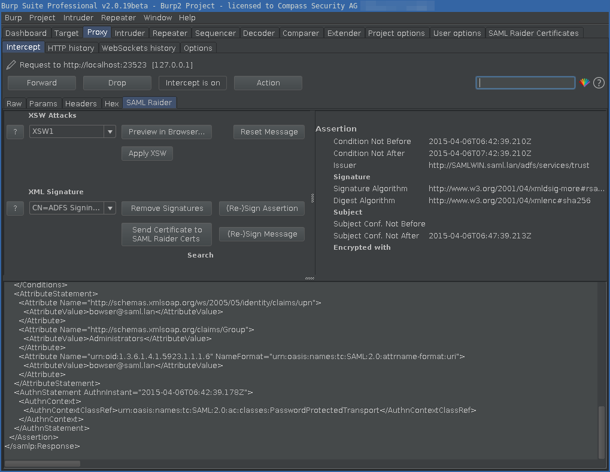
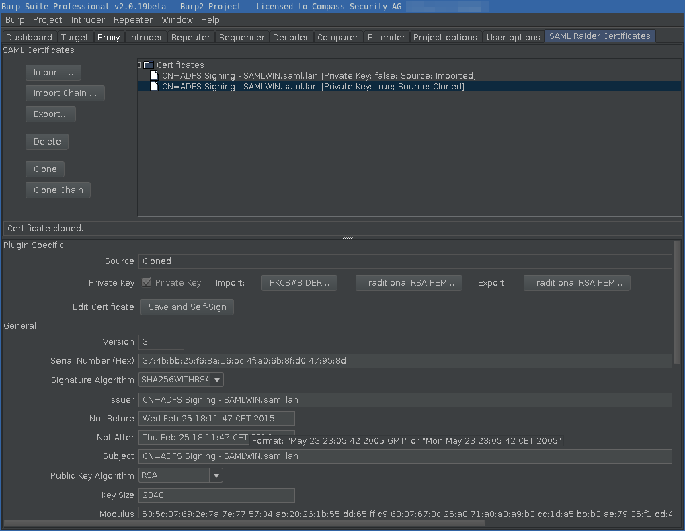

# SAML Raider - SAML2 Burp Extension

## Description

SAML Raider is a Burp Suite extension for testing SAML infrastructures. It
contains two core functionalities: Manipulating SAML Messages and manage X.509
certificates.

This software was created by Roland Bischofberger and Emanuel Duss during
a bachelor thesis at the [Hochschule für Technik
Rapperswil](https://www.hsr.ch) (HSR). Our project partner and advisor was
[Compass Security Schweiz AG](https://www.compass-security.com). We thank Compass for the
nice collaboration and support during our bachelor thesis.

## Features

The extension is divided in two parts. A SAML message editor and a certificate
management tool.

### Message Editor

Features of the SAML Raider message editor:

* Sign SAML Messages
* Sign SAML Assertions
* Remove Signatures
* Edit SAML Message (Supported Messages: SAMLRequest and SAMLResponse)
* Preview eight common XSW Attacks
* Execute eight common XSW Attacks
* Send certificate to SAMl Raider Certificate Management
* Undo all changes of a SAML Message
* Supported Profiles: SAML Webbrowser Single Sign-on Profile, Web Services
  Security SAML Token Profile
* Supported Bindings: POST Binding, Redirect Binding, SOAP Binding, URI Binding

### Certificate Management

Features of the SAML Raider Certificate Management:

* Import X.509 certificates (PEM and DER format)
* Import X.509 certificate chains
* Export X.509 certificates (PEM format)
* Delete imported X.509 certificates
* Display informations of X.509 certificates
* Import private keys (PKCD#8 in DER format and traditional RSA in PEM Format)
* Export private keys (traditional RSA Key PEM Format)
* Cloning X.509 certificates
* Cloning X.509 certificate chains
* Create new X.509 certificates
* Editing and self-sign existing X.509 certificates

## Download

Download: [saml-raider-1.3.0.jar](https://github.com/SAMLRaider/SAMLRaider/releases/download/v1.3.0/saml-raider-1.3.0.jar)

## Installation

### Manual Installation

Start the Burp Suite and click at the `Extender` tab on `Add`. Choose the SAML
Raider JAR file to install the extension.

### Installation from BApp Store

The easy way to install SAML Raider is using the BApp Store. Open Burp and
click in the `Extender` tab on the `BApp Store` tab. Select `SAML Raider` and
hit the `Install` button to install our extension.

Don't forget to rate our extension with as many stars you like :smile:.

## Usage

To test SAML environments more comfortable, you could add a intercept rule in
the proxy settings. Add a new rule which checks if a Parameter Name
`SAMLResponse` is in the request. We hope the usage of our extension is mostly
self explaining :smile:. If you have questions, don't hesitate to ask us!

## Development

### Burp Extender API

The Burp Extender API can be found here:
https://portswigger.net/burp/extender/api/index.html.

### Build

Clone the project into your workspace:

    git clone https://github.com/SAMLRaider/SAMLRaider.git

Import existing project into your Eclipse workspace: `File` → `Import...` →
`Existing Projects into Workspace`. Select the cloned folder and press `Finish`.

[Download](https://portswigger.net/burp/download.html) the latest version of
Burp Suite as a JAR file and place it in the `lib` folder.

Add the Burp Suite JAR file to the libraries: Rightclick on Project →
`Properties` → `Java Build Path` → `Libraries` and add the JAR file.

Install `maven` so you can build SAMLRaider using the build automation tool
Maven:

    $ mvn install

You can also build it without executing the tests:

    $ mvn install -Dmaven.test.skip=true

Load the Burp Extension into Burp: `Extender` → `Add` → select the JAR file
(with dependencies) in the `./target` directory of the project, like
`./target/saml-raider-$VERSION-SNAPSHOT-jar-with-dependencies.jar`.

Then you can test the extension and rebuild it again after a change.

Tipp: To reload the extension in Burp, without restarting Burp, hit the `Ctrl`
key and click on the checkbox next to the extension in the `Extender` tab.

### Run SAML Raider inside Eclipse

To start the Extension directly from Eclipse, import the Repository into
Eclipse. You can directly import a existing Maven Project. Note that the
Eclipse Maven Plugin `m2e` is required. This is included in the latest "Eclipse
IDE for Java Developers".

Place the Burp Suite JAR file into the `lib` folder and add the Burp JAR as
a Library in the Eclipse Project (`Properties` → `Build Path` → `Libraries`).

Open the Burp JAR under `Referenced Libraries` in the Package Explorer and
right click in the Package `burp` on `StartBurp.class` and select `Run As...` →
`Java Application` to start Burp and load the Extension automatically.  (Or in
Eclipse: `Run` → `Debug As` → `Java Application` → `StartBurp - burp` → `OK`.)

### Debug Mode

To enable the Debug Mode, set the `DEBUG` Flag in the Class `Flags` from the
Package `helpers` to `true`. This will write all output to the
`SAMLRaiderDebug.log` logfile and load example certificates for testing.

### Test with fake SAML Response

To send a SAML Response to Burp, you can use the script `samltest` in the
`scripts/samltest` directory. It sends the SAML Response from `saml_response`
to Burp (`localhost:8080`) and prints out the modified response from our
plugin. You have to install `gawk` (GNU awk) as `awk` and `libxml2-utils` for
the `xmllint` command.

## Feedback, Bugs and Feature Requests

Feedback is welcome! Please contact us or create a new issue on GitHub.

## Bachelor Thesis

Our Bachelor thesis is available online and can  be found here:
[eprints_BA_SAML2_Burp_Plugin_SAML_Raider_eduss_rbischof.pdf](http://eprints.hsr.ch/464/1/eprints_BA_SAML2_Burp_Plugin_SAML_Raider_eduss_rbischof.pdf).

## License

See the [LICENSE](LICENSE) file (MIT License) for license rights and
limitations.

## References

SAML Raider is on the Internet :).

### General

- PortSwigger Burp BApp Store: https://portswigger.net/bappstore/c61cfa893bb14db4b01775554f7b802e
- SAML Raider in our Company Blog @CompassSecurity: https://blog.compass-security.com/tag/saml-raider/
- Schwachstellen in SAML 2.0 Implementationen: https://www.syssec.at/en/veranstaltungen/archiv/dachsecurity2016/papers/DACH_Security_2016_Paper_12A1.pdf

### SAML Hacking Tutorials

- Awesome SAML Security Testing Blog Posts by @epi052:
  - SAML Testing Methodology Basics: https://epi052.gitlab.io/notes-to-self/blog/2019-03-07-how-to-test-saml-a-methodology/
  - SAML Testing Methodology using SAML Raider: https://epi052.gitlab.io/notes-to-self/blog/2019-03-13-how-to-test-saml-a-methodology-part-two/
- Hack SAML Single Sign-on with Burp Suite: https://null-byte.wonderhowto.com/how-to/hack-saml-single-sign-with-burp-suite-0184405/
- Attacking SSO: Common SAML Vulnerabilities and Ways to Find Them: https://blog.netspi.com/attacking-sso-common-saml-vulnerabilities-ways-find/
- How to use Burp Suite to verify SAML Signature Wrapping attack: https://blog.ritvn.com/testing/2018/02/16/burp-suite-saml-signature-wrapping-attack.html
- Vulnerabilities Related to SAML: https://varutra.com/blog/?p=1945b
- Owning SAML: https://www.anitian.com/owning-saml/

### Discovered Vulnerabilities using SAML Raider

- CVE-2015-5372: nevisAuth Authentication Bypass (Signature Spoofing)
  - Blog Post: https://blog.compass-security.com/2015/09/saml-sp-authentication-bypass-vulnerability-in-nevisauth/
  - Advisory: https://www.compass-security.com/fileadmin/Datein/Research/Advisories/CVE-2015-5372_AdNovum_nevisAuth_Authentication_Bypass.txt
- Slack SAML Authentication Bypass:
  - Blog Post: https://blog.intothesymmetry.com/2017/10/slack-saml-authentication-bypass.html
- CVE-2020-12676: FusionAuth Signature Exclusion Attack
  - Advisory: https://compass-security.com/fileadmin/Research/Advisories/2020-06_CSNC-2020-002_FusionAuth_Signature_Exclusion_Attack.txt

### Other

- SANS Burp Suite Cheat Sheet recommends SAML Raider: https://www.sans.org/security-resources/posters/pen-testing/burp-suite-cheat-sheet-280?msc=Cheat+Sheet+Blog

## Authors

* Roland Bischofberger (GitHub: [RouLee](https://github.com/RouLee))
* Emanuel Duss (GitHub: [mindfuckup](https://github.com/mindfuckup))
