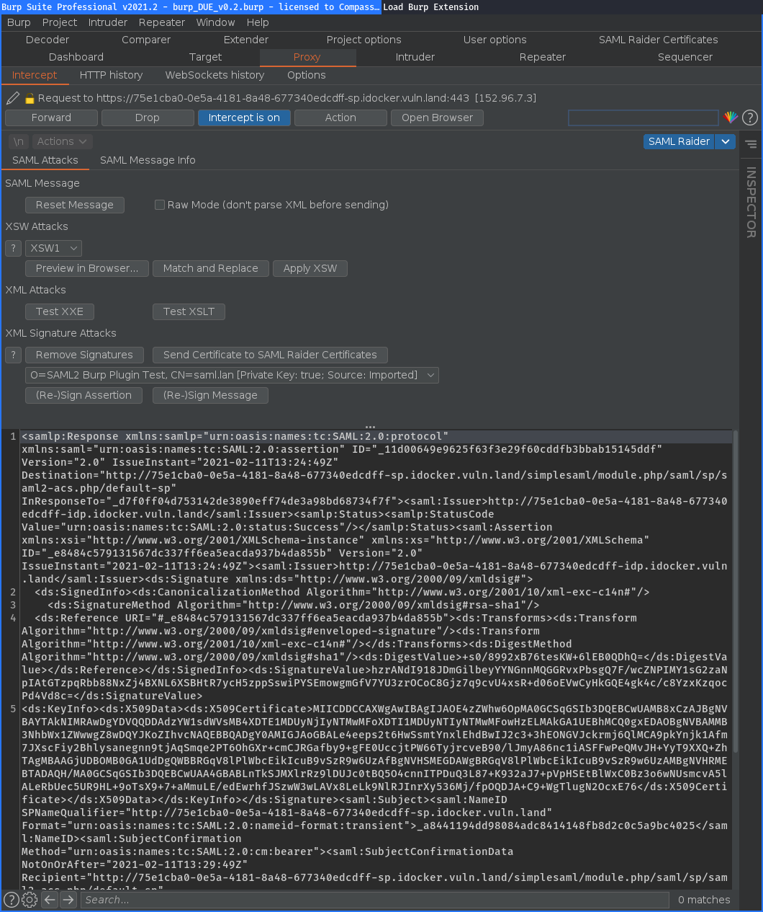
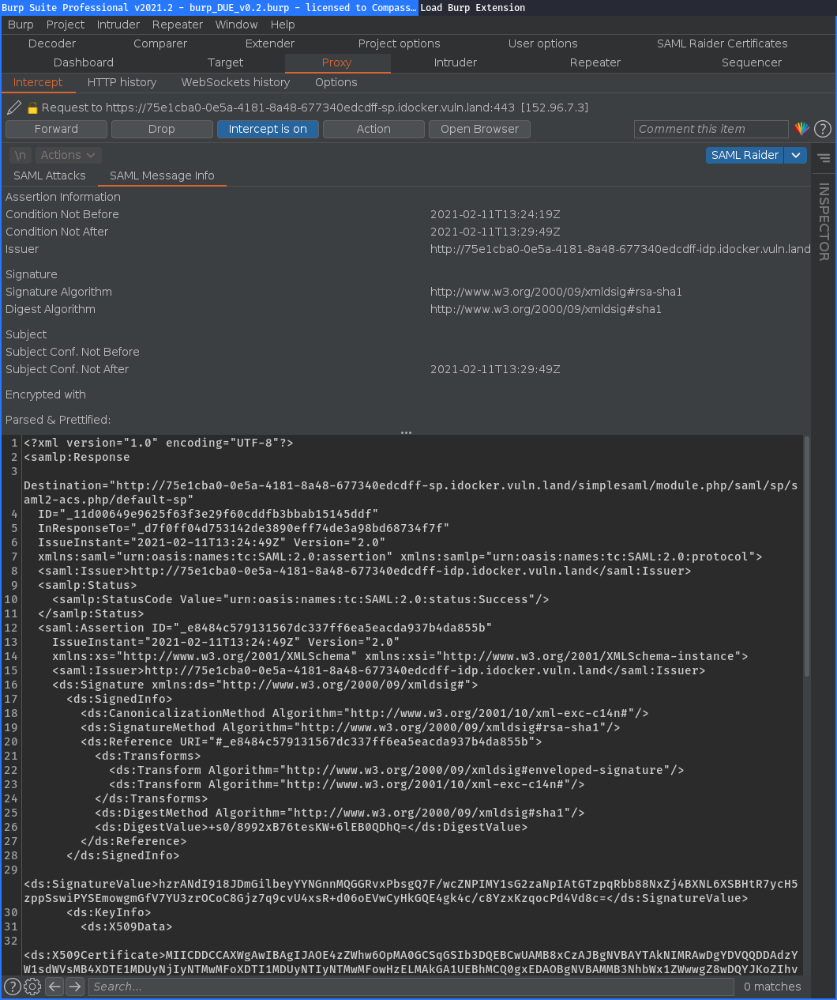
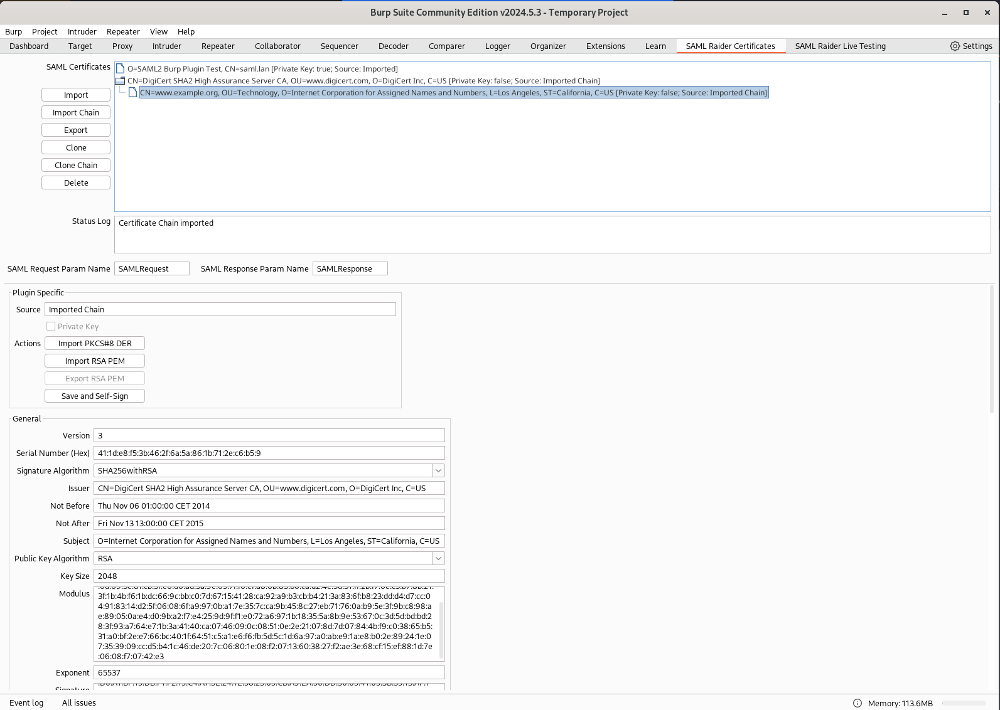

# SAML Raider - SAML2 Burp Extension

## Description

SAML Raider is a Burp Suite extension for testing SAML infrastructures. It
contains two core functionalities: Manipulating SAML Messages and manage X.509
certificates.

This software was originally created by Roland Bischofberger and [Emanuel
Duss](https://github.com/emanuelduss) (@emanuelduss) during a bachelor thesis at
the [Hochschule für Technik Rapperswil](https://www.hsr.ch) (HSR). 

## Features

The extension is divided in two parts. A SAML message editor and a certificate
management tool.

### Message Editor

Features of the SAML Raider message editor:

* Sign SAML messages & assertions (signature spoofing attack)
* Remove signatures (signature exclusion attack)
* Edit SAML messages (SAMLRequest, SAMLResponse & custom parameter names)
* Perform eight common XSW attacks
* Insert XXE and XSLT attack payloads
* Supported Profiles: SAML Webbrowser Single Sign-on Profile, Web Services
  Security SAML Token Profile
* Supported Bindings: POST Binding, Redirect Binding, SOAP Binding, URI Binding

SAML Attacks:

SAML Message Info:

### Certificate Management

Features of the SAML Raider Certificate Management:

* Import X.509 certificates (PEM and DER format)
* Import X.509 certificate chains
* Export X.509 certificates (PEM format)
* Delete imported X.509 certificates
* Display informations of X.509 certificates
* Import private keys (PKCD#8 in DER format and traditional RSA in PEM Format)
* Export private keys (traditional RSA Key PEM Format)
* Cloning X.509 certificates
* Cloning X.509 certificate chains
* Create new X.509 certificates
* Editing and self-sign existing X.509 certificates

Certificate Management:

## Demo

SAML Signature Spoofing Demo:

FusionAuth XXE Demo (CVE-2021-27736):

## Installation

### Installation from BApp Store

The recommended and easiest way to install SAML Raider is using the BApp Store.
Open Burp and click in the `Extensions` tab on the `BApp Store` tab. Select `SAML
Raider` and hit the `Install` button to install our extension.

Don't forget to rate our extension with as many stars you like :smile:.

### Manual Installation

First, download the latest SAML Raider version:
[saml-raider-2.5.1.jar](https://github.com/SAMLRaider/SAMLRaider/releases/download/v2.5.1/saml-raider-2.5.1.jar).
Then, start Burp Suite and click in the `Extensions` tab on `Add`. Choose the
SAML Raider JAR file to install it and you are ready to go.

## Usage Hints

To test SAML environments more comfortable, you could add a intercept rule in
the proxy settings. Add a new rule which checks if a Parameter Name
`SAMLResponse` is in the request. We hope the usage of our extension is mostly
self explaining :smile:. If you have questions, don't hesitate to ask us!

If you have a custom parameter name for a SAML message, this can be configured
in the SAML Raider Certificates tab.

If you don't want to let SAML Raider parse your SAML message before sending to
the server (e.g. when performing XXE attacks), use the raw mode.

## Development

See [hacking](doc/hacking.md).

## Feedback, Bugs and Feature Requests

Feedback is welcome! Please contact us or create a new issue on GitHub.

## License

See the [LICENSE](LICENSE) file (MIT License) for license rights and
limitations.

## References

SAML Raider is on the Internet :).

### Bachelor Thesis

- Our bachelor thesis where SAML Raider was born:
[eprints_BA_SAML2_Burp_Plugin_SAML_Raider_eduss_rbischof.pdf](https://eprints.ost.ch/464/1/eprints_BA_SAML2_Burp_Plugin_SAML_Raider_eduss_rbischof.pdf).

### General

- PortSwigger Burp BApp Store: https://portswigger.net/bappstore/c61cfa893bb14db4b01775554f7b802e
- SAML Raider in our Company Blog @CompassSecurity: https://blog.compass-security.com/tag/saml-raider/
- Schwachstellen in SAML 2.0 Implementationen: https://www.syssec.at/en/veranstaltungen/archiv/dachsecurity2016/papers/DACH_Security_2016_Paper_12A1.pdf

### SAML Hacking Tutorials

- Awesome SAML Security Testing Blog Posts by @epi052:
  - SAML Testing Methodology Basics: https://epi052.gitlab.io/notes-to-self/blog/2019-03-07-how-to-test-saml-a-methodology/
  - SAML Testing Methodology using SAML Raider: https://epi052.gitlab.io/notes-to-self/blog/2019-03-13-how-to-test-saml-a-methodology-part-two/
- Hack SAML Single Sign-on with Burp Suite: https://null-byte.wonderhowto.com/how-to/hack-saml-single-sign-with-burp-suite-0184405/
- Attacking SSO: Common SAML Vulnerabilities and Ways to Find Them: https://blog.netspi.com/attacking-sso-common-saml-vulnerabilities-ways-find/
- How to use Burp Suite to verify SAML Signature Wrapping attack: https://blog.ritvn.com/testing/2018/02/16/burp-suite-saml-signature-wrapping-attack.html
- Vulnerabilities Related to SAML: https://varutra.com/blog/?p=1945b
- Owning SAML: https://www.anitian.com/owning-saml/

### Discovered Vulnerabilities using SAML Raider

- CVE-2015-5372: nevisAuth Authentication Bypass (Signature Spoofing)
  - Blog Post: https://blog.compass-security.com/2015/09/saml-sp-authentication-bypass-vulnerability-in-nevisauth/
  - Advisory: https://www.compass-security.com/fileadmin/Datein/Research/Advisories/CVE-2015-5372_AdNovum_nevisAuth_Authentication_Bypass.txt
- Slack SAML Authentication Bypass:
  - Blog Post: https://blog.intothesymmetry.com/2017/10/slack-saml-authentication-bypass.html
- CVE-2020-12676: FusionAuth Signature Exclusion Attack
  - Advisory: https://compass-security.com/fileadmin/Research/Advisories/2020-06_CSNC-2020-002_FusionAuth_Signature_Exclusion_Attack.txt
- CVE-2021-27736: FusionAuth SAML Library
  - Advisory: https://www.compass-security.com/fileadmin/Research/Advisories/2021-03_CSNC-2021-004_FusionAuth_SAML_Library_XML_External_Entity.txt

### Other

- SANS Burp Suite Cheat Sheet recommends SAML Raider: https://www.sans.org/posters/burp-suite-cheat-sheet/

## Authors

* Roland Bischofberger (GitHub: [RouLee](https://github.com/RouLee))
* Emanuel Duss (GitHub: [emanuelduss](https://github.com/emanuelduss))
* Tobias Hort-Giess (GitHub: [t-hg](https://github.com/t-hg))
