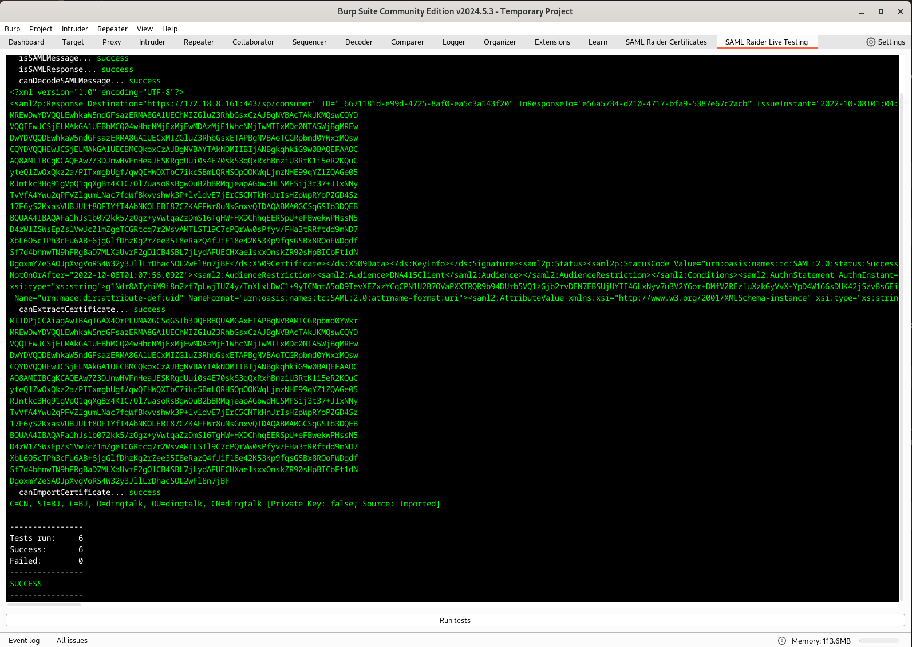

## Development

### Burp Extension Montoya API

The Burp Extension Montoya API can be found here:

- https://portswigger.github.io/burp-extensions-montoya-api/javadoc/burp/api/montoya/MontoyaApi.html
- https://github.com/PortSwigger/burp-extensions-montoya-api
- https://github.com/PortSwigger/burp-extensions-montoya-api-examples

### Build

Linux:

```shell
./gradlew jar
```

Windows: 

```shell
.\gradlew.bat jar
```

Get the jar from `build/libs/saml-raider-<version>.jar`

Load the Burp Extension into Burp: `Extensions` → `Add` → select the JAR file

Then you can test the extension and rebuild it again after a change.

Tipp: To reload the extension in Burp, without restarting Burp, hit the `Ctrl`
key and click on the checkbox next to the extension in the `Extensions` tab.

### Debug Mode

To enable the debug mode, start Burp with the Java VM option `-Dsamlraider.debug`.
This will load example certificates for testing. Also, a new tab called `SAML Raider Live Testing`
will appear where tests can be run. See `Live Testing` section for more information.

### Live Testing

This extension is programmed against Burp's Montoya API. This API consists of only interfaces. Concrete
implementations to those interfaces are only available during runtime. This makes it difficult to write
automated tests (unit tests). See also https://github.com/PortSwigger/burp-extensions-montoya-api/issues/97. 
To still be able to write some tests against concrete implementations, tests can be written under the 
`livetesting` package (follow the instructions in `livetesting/package-info.java`). When in debug mode, a new will 
be rendered, on which these defined tests can be executed.



### Debugging

Start Burp with the Java Debug Wire Protocol (JWDP) server:

```
$ java -agentlib:jdwp=transport=dt_socket,server=y,suspend=n,address=5005 -jar burpsuite_community_*.jar
```

Attach the your IDE to the debugger. In IntelliJ:

- Run → Edit Configurations
- New Configuration: Remote JVM Debug (apply defaults)

Attach your IDE to the running Burp process:

- Run → Debug "Burp"

Build the extension, load the JAR into Burp, set breakpoints and start debugging.

Check out the following article for more information: 
https://www.netspi.com/blog/technical/web-application-penetration-testing/debugging-burp-extensions/

### Test with fake SAML Response

To send a SAML Response to Burp, you can use the script `samltest` in the
`scripts/samltest` directory. It sends the SAML Response from `saml_response`
to Burp (`localhost:8080`) and prints out the modified response from our
plugin. You have to install `gawk` (GNU awk) as `awk` and `libxml2-utils` for
the `xmllint` command.
